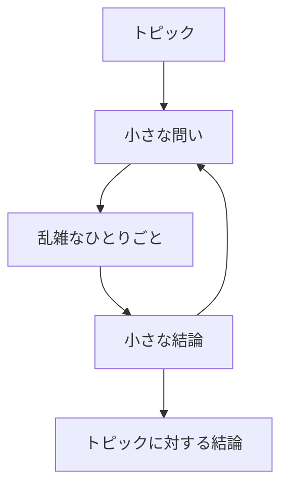

# ひとりごとのように、思考を整理する

頭の中に渦巻く、ごちゃっとしたものを叩き出す。
不満や愚痴からアイデアまで、あらゆる思いつきをブラッシュアップすることができます。

※現在はプロトタイプ版です。入力したデータが消える可能性があるため、本格使用は控えてください。

---

## MonoLog について

ひとりごと型思考整理アプリ MonoLog は、“**メモよりもテキトーに、ひとりごとよりもシンプルに**”をコンセプトに作られたアプリケーションです。

製作者は、自分の思考を整理するのに、よく「チャットアプリに思いついたことを乱雑に書き出す」ということをやっていました。
この方法で、現状に対する不安や不満・愚痴から始まり、そこに対する解決策や為すべき行動を見つけたり、一つのテーマに対してブレインストーミングを一人で行ったりしてきました。

しかし、チャットアプリだと流れてしまったり、要点を見返しずらかったりなどのデメリットもあり、記録することに特化したメモアプリだと綺麗に書こうとして思考の経過が残しずらい。
そこで、生まれたのが MonoLog です。

MonoLog は、「ひとりごと」を意味する「monolog（モノローグ）」に、「記録」を意味する「log（ログ）」の意味を強調したプロダクト名となっています。

完成したら自分が一番使いたいアプリケーションを作成しました。

---

## MonoLog の使い方

このアプリは、主に次の二つの画面で構成されています。

- トピック一覧ページ
- ひとりごとページ

### トピック一覧ページの使い方

考えたいこと毎に部屋を分けることができます。

「トピック名」の箇所で考えたいことを入力し、部屋を作成します。
部屋を作成したら、作成した部屋に入り、乱雑に思いのまま入力していきましょう！

未実装の機能が多いため、下記の「今後の追加予定の機能」を確認してください。

### ひとりごとページの使い方

テキストを入力して、思いついたままに叩き出してみましょう。

のように進めていきます。（各役割を扱いやすくする機能は未実装です）

未実装の機能が多いため、下記の「今後の追加予定の機能」を確認してください。

---

## 今後の追加予定の機能

### トピック一覧ページ

- トピック名を変更できる機能を実装します。
- トピックを削除・アーカイブする機能を実装します。
- トピックの並び順を新着順以外にする方法を実装します。
- トピック毎にアイコンを設置する機能を実装します。
- トピックとその内容を検索する機能を実装します。

### ひとりごとページの使い方

- テキストを改行できる仕様にします。
- ひとりごとを削除・アーカイブする機能を実装します。
- トピック名を変更できる機能を実装します。
- ひとりごとに要点を見返しやすいように「役割」を与える機能を実装します。
- ひとりごとの並び順を新着順以外にする方法を実装します。
- 部屋の中のひとりごとを検索する機能を実装します。
- ChatGPT に関する機能を実装したいです。

---

## ChatGPT に関する機能を実装したいです。

→ Twitter: [@dev_takeaki0817](https://twitter.com/dev_takeaki0817)

→ GitHub: [Takeaki0817](https://github.com/Takeaki0817)
